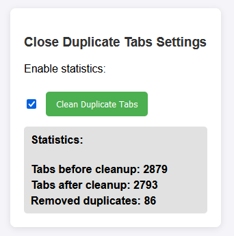

# Close Duplicate Tabs  

A lightweight Firefox extension that removes duplicate tabs while keeping the latest one open. Click the extension icon to perform the cleanup. Includes an option to display statistics about the cleanup process.  

## Features  
- Detects and closes duplicate tabs.  
- Keeps the most recently opened tab for each URL.  
- Easy to use, manual control with a single click.  
- Optional cleanup statistics:  
  - Number of tabs before cleanup.  
  - Number of tabs after cleanup.  
  - Number of duplicate tabs removed.  

## Installation  
1. Clone this repository:  
   ```bash  
   git clone https://github.com/az-xx/close-duplicate-tabs.git  
   ```
2. Open Firefox and navigate to `about:debugging`.  
3. Click **This Firefox** > **Load Temporary Add-on**.  
4. Select the `manifest.json` file from the cloned folder.  

## How to Use  
1. Open multiple tabs with duplicate URLs.  
2. Click the extension icon in the toolbar.  
3. If the statistics option is enabled:  
   - A popup will display the number of tabs before and after cleanup and the number of duplicates removed.  

## Enabling Statistics  
1. Open the extension options:  
   - Navigate to `about:addons` in Firefox.  
   - Locate **Close Duplicate Tabs** and click **Preferences** or **Options**.  
2. Enable the **Show cleanup statistics** checkbox.  
3. Save your changes.  

## Contributing  


Feel free to submit issues or pull requests for improvements.  

## Future Enhancements  
- Provide detailed logs for advanced users.  
- Add options for automatic cleanup intervals.  


# إغلاق التبويبات المكررة  

إضافة خفيفة لمتصفح فايرفوكس تقوم بإغلاق التبويبات المكررة مع الاحتفاظ بأحدث تبويب مفتوح لكل رابط. يمكنك النقر على أيقونة الإضافة لتنفيذ عملية التنظيف. تتضمن خيارًا لعرض إحصائيات حول عملية التنظيف.  

## المميزات  
- اكتشاف وإغلاق التبويبات المكررة.  
- الاحتفاظ بأحدث تبويب مفتوح لكل عنوان URL.  
- سهلة الاستخدام، تحكم يدوي بنقرة واحدة.  
- إحصائيات اختيارية لعملية التنظيف:  
  - عدد التبويبات قبل التنظيف.  
  - عدد التبويبات بعد التنظيف.  
  - عدد التبويبات المكررة التي تمت إزالتها.  

## خطوات التثبيت  
1. قم باستنساخ المستودع:  
   ```bash  
   git clone https://github.com/az-xx/close-duplicate-tabs.git  
   ```
2. افتح متصفح فايرفوكس وانتقل إلى `about:debugging`.  
3. انقر على **This Firefox** > **Load Temporary Add-on**.  
4. اختر ملف `manifest.json` من المجلد الذي تم استنساخه.  

## كيفية الاستخدام  
1. افتح عدة تبويبات تحتوي على روابط مكررة.  
2. انقر على أيقونة الإضافة في شريط الأدوات.  
3. إذا كان خيار الإحصائيات مفعلاً:  
   - ستظهر نافذة تعرض عدد التبويبات قبل وبعد التنظيف وعدد التبويبات المكررة التي تمت إزالتها.  

## تفعيل الإحصائيات  
1. افتح إعدادات الإضافة:  
   - انتقل إلى `about:addons` في فايرفوكس.  
   - حدد **إغلاق التبويبات المكررة** وانقر على **Preferences** أو **Options**.  
2. قم بتفعيل خيار **عرض إحصائيات التنظيف**.  
3. احفظ التعديلات.  

## المساهمة  


يمكنك تقديم مشاكل أو طلبات تحسين عبر المستودع.  

## التحسينات المستقبلية  
- توفير سجلات تفصيلية للمستخدمين المتقدمين.  
- إضافة خيارات لتنظيف التبويبات تلقائيًا على فترات زمنية محددة.  
